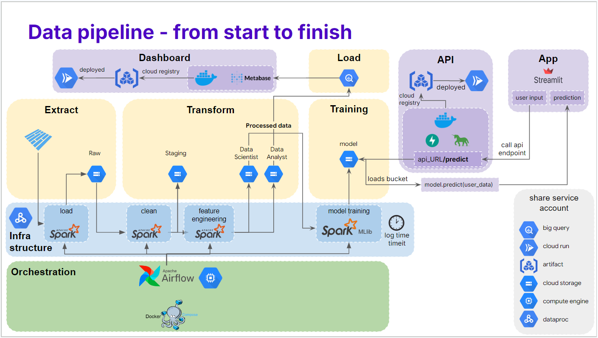
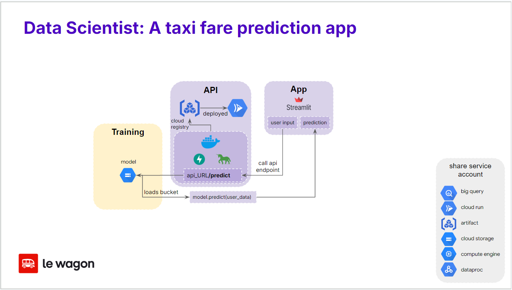

**This repository is part of a larger project.**

# The Taxifare Optimization project


This project was completed as part of a Data Engineering Bootcamp at Le Wagon Paris and presented at Demo Day on November 8, 2024 ([View Project Demo Slides](https://docs.google.com/presentation/d/1KzT-0eyGO49xolFUZCZogSsWtMxqtQoaWvM5D2JieoY/edit?usp=sharing)).

The objective of this project was to build a complete ETL and machine learning pipeline—from data ingestion to an end-user interface—using tools covered in the bootcamp. Given a four-day timeframe, we leveraged previous bootcamp exercises as a foundation, enabling us to focus on optimizing and studying the performance of the pipeline.

Repositories that are part of the Taxifare Project:
- **Taxifare**:
A data engineering pipeline that ingests, processes, and stores NYC taxi ride data in cloud storage and a data warehouse.
  - Distributed processing with `Spark`, on `Dataproc`
  - Job orchestration using `Airflow`.
  - Cloud storage on `Google Cloud Storage`
  - Analytical warehouse with `BigQuery`
- [**Taxifare API**](https://github.com/Arivima/Le_Wagon_MLOps_Optimization_Taxifare_API):
A cloud-deployed API providing a prediction endpoint.
  - Built with `FastAPi` and `Gunicorn`
  - Deployed on `Google Cloud Run`, using a `Docker` image hosted in `Artifact Registery`
- [**Taxifare Front**](https://github.com/Arivima/Le_Wagon_MLOps_Optimization_Taxifare_Front):
A `Streamlit` application that allows users to predict taxi fares with our model.


*The project complete pipeline*



# Taxifare Front

This project is a **Streamlit** application that estimates New York taxi fares based on user inputs such as ride date, time, pickup and dropoff locations, and number of passengers. It uses a backend API for fare prediction, and is part of a larger project built during a **Data Engineering Bootcamp** at **Le Wagon Paris**.



*The front flow*

## Readme Sections
- [Features](#features)
- [Prerequisites](#prerequisites)
- [Usage](#usage)
- [Installation](#installation)
- [Usage](#usage)
- [Dependencies](#dependencies) - [License](#license)
## Features

- **Interactive Map**: Select pickup and dropoff locations by clicking on a map.
- **Customizable Ride Options**: Input ride date, time, and passenger count.
- **API Integration**: Connects to a machine learning model API for fare predictions.

## Prerequisites
- **Python 3.9.6**
- **Poetry** for dependency management

## Installation
1. Clone the repository:
   ```bash
   git clone https://github.com/Arivima/le-wagon-mlops-optimization-taxifare-front.git
   cd le-wagon-mlops-optimization-taxifare-front
   ```

2. Install dependencies using Poetry:
   ```bash
   poetry install
   ```

3. Run the Streamlit app:
   ```bash
   poetry run streamlit run map.py
   ```
4. Access the App:

After running the command, you will see output in the terminal with a local URL (e.g., http://localhost:8501). Open this URL in your web browser to access the Taxi Fare Estimator application.

## Usage

- Select the date and time for your ride.
- Input the number of passengers (between 0 and 8).
- Click on the map to select the pickup and dropoff locations.
- The estimated fare will be displayed based on the selected parameters.

## Dependencies

This project uses the following libraries:
- **Streamlit**: For the web interface
- **Folium** and **Streamlit-Folium**: For interactive map integration
- **Requests**: For making HTTP requests to the prediction API
- **Emoji**: For displaying emojis in the app

Dependencies are managed using Poetry. See `pyproject.toml` for version details.

## License

This project is licensed under the MIT License. See the [LICENSE](./LICENSE) file for details.
